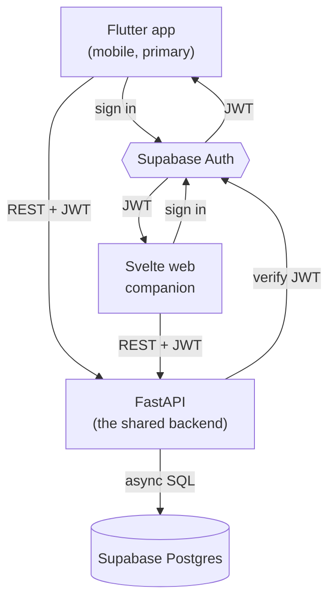

## The shape of the system

FitTrack is **one backend, two clients, and a managed platform underneath**.

Both clients **authenticate with Supabase Auth** and receive a JWT. From then on, every request to the backend carries that token, and **FastAPI is the only thing that touches the data** — it verifies the JWT, runs the business logic, and reads and writes the Supabase Postgres over an async connection. The clients never query the database directly.

## Why this split

Supabase can be used as a pure backend-as-a-service — clients talking straight to its Postgres through Row-Level Security. FitTrack deliberately doesn't do that. It puts **FastAPI in the middle** for three reasons:

- **One place for business logic.** "What counts as a personal record", "how weekly volume is computed", "which exercises a user may edit" — these belong in code you own and test, not spread across two client apps and a pile of SQL policies.
- **Two clients, one contract.** The Flutter app and the Svelte companion are very different, but they consume the *same* REST API. Change a rule once, both clients get it. That's the whole point of the project: build a product twice on one backend.
- **It teaches a real Python backend.** FastAPI, async SQLAlchemy, Pydantic, dependency-injected auth — the substance of a production API — is exactly what a client-only Supabase setup would skip.

Supabase still earns its place: **Auth** (sign-up, sign-in, token refresh, OAuth, all with first-class client SDKs) and a **managed Postgres** (no database to run or back up yourself) are real work you don't have to build. Row-Level Security stays on as **defense-in-depth**, so that even if a token leaked, the database itself still enforces ownership.

## The pieces

- **Supabase Auth** — issues and refreshes JWTs. The clients use the official SDKs (`supabase_flutter`, `supabase-js`); the backend only ever *verifies* the token.
- **FastAPI** — the shared backend. Verifies the Supabase JWT on every request, owns the domain logic, and is the sole reader/writer of the database.
- **Supabase Postgres** — the managed database. FitTrack's tables: `profiles`, `exercises`, `workouts`, `workout_sets`.
- **Flutter app** — the primary, mobile-first client: sign in, start a workout, log sets, review history and progress.
- **Svelte web companion** — a lighter dashboard on the same API, read-focused.

## Verify

You're ready to move on when you can answer these in your own words:

- Trace a "log a set" action from a tap in the Flutter app all the way to a row in Postgres. Where does the JWT get created, attached, and verified?
- Why does the backend only *verify* the Supabase JWT rather than issue its own?
- If Row-Level Security is defense-in-depth and FastAPI is the real gate, what breaks if you forget the `get_current_user` check on one endpoint — and what does RLS still protect?

Next, the [prerequisites](/fittrack/en/introduction/prerequisites/) get your machine ready.
