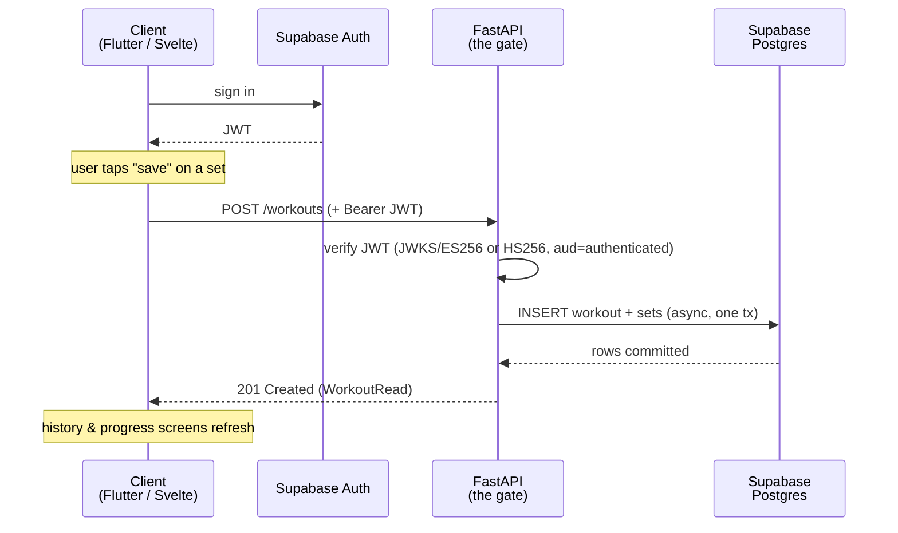

## What you built

You built **FitTrack**: a workout tracker with a native **Flutter** app, a **SvelteKit** web companion, and a single **FastAPI** backend, backed by **Supabase** for authentication and managed Postgres — and, in the last module, you deployed all of it.

Trace it by module and it's a complete product, not a toy:

- A `uv`-managed FastAPI project ([Module 1](/fittrack/en/setup/python-toolchain/)) with a real database defined as migrations ([Module 2](/fittrack/en/supabase/schema-and-migrations/)).
- An async, configured, structured backend ([Module 3](/fittrack/en/fastapi/app-and-config/)) that verifies Supabase JWTs and knows who the caller is ([Module 4](/fittrack/en/auth/verify-the-jwt/)).
- A domain layer — SQLAlchemy models, Pydantic schemas, repositories ([Module 5](/fittrack/en/domain/sqlalchemy-models/)) — under a full REST surface: an exercise catalog ([Module 6](/fittrack/en/exercises/catalog-crud/)), workout logging ([Module 7](/fittrack/en/workouts/logging-sessions/)), and progress aggregations ([Module 8](/fittrack/en/progress/aggregation-queries/)).
- Two clients on that one API: a Flutter app with Riverpod, Supabase auth, and a typed API client ([Module 9](/fittrack/en/flutter-foundation/project-and-state/)) that logs sets and shows history ([Module 10](/fittrack/en/flutter-tracking/logging-ui/)), and a SvelteKit dashboard reading the same endpoints ([Module 11](/fittrack/en/svelte-companion/dashboard/)).
- Tests over the backend and the tracking UI ([Module 12](/fittrack/en/testing/pytest-backend/)), then a containerized API on hosted Supabase with both clients shipped ([Module 13](/fittrack/en/deployment/containerize-the-api/)).

## The path of a logged set

Everything above collapses into one motion: a user logs a set, and it travels the whole system. Here is that round trip — the same for the Flutter app and the Svelte companion, because they share a backend.

Read it top to bottom and every module has a place in it. The client got its **JWT** from Supabase Auth ([Module 4](/fittrack/en/auth/verify-the-jwt/)). FastAPI **verified** that token before doing anything ([Module 4](/fittrack/en/auth/current-user/)). The write went in as **one async transaction** through the domain layer ([Module 7](/fittrack/en/workouts/logging-sessions/)). And the response came back as a typed **Pydantic** shape ([Module 5](/fittrack/en/domain/schemas-and-repositories/)) the client rendered. The clients never touch the database — FastAPI is the only thing that does.

## The decisions you can now defend

Every one of these was a fork in the road with a real alternative. You can now say *why* you went the way you did — and what it cost.

| Decision | Why it wins | The tradeoff | Where you made it |
|---|---|---|---|
| **FastAPI as the shared backend** | One place owns business logic and data access; both clients stay thin and consistent. | A hop the clients could have skipped by talking to Supabase directly. | [Architecture →](/fittrack/en/introduction/architecture/) |
| **Supabase for Auth + managed Postgres** | You didn't build password resets, token issuance, or run a database — you used a managed one and wrote features. | A platform dependency; you live within Supabase's model and pricing. | [Auth & RLS →](/fittrack/en/supabase/auth-and-rls/) |
| **RLS as defense-in-depth** | If a token ever reached the database directly, row policies still fence users to their own rows. | Policies to maintain that the API path never exercises day to day. | [Auth & RLS →](/fittrack/en/supabase/auth-and-rls/) |
| **One repo, two clients** | Shared API contract, one source of truth, atomic cross-client changes. | A larger repo and two very different build/ship pipelines to keep green. | [Architecture →](/fittrack/en/introduction/architecture/) |
| **Async SQLAlchemy 2.0** | Non-blocking DB I/O matches FastAPI's async model and scales under concurrent requests. | The async engine and session dependency are more ceremony than a sync ORM. | [Async database →](/fittrack/en/fastapi/async-database/) |
| **Local-first development** | The whole stack — Postgres, Auth, migrations — ran on your machine, so production was a config change, not a rewrite. | You run the Supabase CLI stack locally instead of developing against the cloud. | [Schema & migrations →](/fittrack/en/supabase/schema-and-migrations/) |

## What was deliberately simplified

FitTrack is scoped, not unfinished. Each of these was a conscious "not now" so the course could teach the core end to end instead of sprawling:

- **No training programs or plans.** You log what you *did*; the app doesn't prescribe what to do next. That's a whole scheduling and templating domain, left for [Next steps →](/fittrack/en/wrap-up/next-steps/).
- **No social or sharing.** No followers, feeds, or shared workouts. Every row belongs to one user, which kept the [auth and RLS model](/fittrack/en/supabase/auth-and-rls/) simple.
- **No nutrition.** Food and calories are an entire second product; FitTrack tracks training only, by design ([product scope](/fittrack/en/introduction/architecture/)).
- **No offline sync.** The Flutter app assumes a connection and talks to the API live ([Module 10](/fittrack/en/flutter-tracking/logging-ui/)); a local cache with conflict resolution is a serious feature of its own.
- **A minimal profile.** `profiles` holds a `display_name` and little else ([the schema](/fittrack/en/supabase/schema-and-migrations/)) — enough to own workouts, nothing more.

None of these are missing by accident. They're the natural next features, and the [next lesson →](/fittrack/en/wrap-up/next-steps/) shows exactly where each one plugs into what you already built.

## Recap

You built a real, deployed, two-client fitness tracker on a single FastAPI backend and managed Supabase, and you can now trace a logged set through **client → Supabase Auth → FastAPI → Postgres → back** without hand-waving. More than the code, you leave with **decisions you can defend**: why FastAPI is the gate, why Supabase, why RLS is a backstop rather than the front door, why one repo, why async, why local-first — each with the tradeoff it carries. And you know exactly what you *didn't* build and why. Next, [Next steps →](/fittrack/en/wrap-up/next-steps/) turns those deliberate omissions into your roadmap — the concrete features to add, what each one teaches, and where it plugs into the system you already have.
