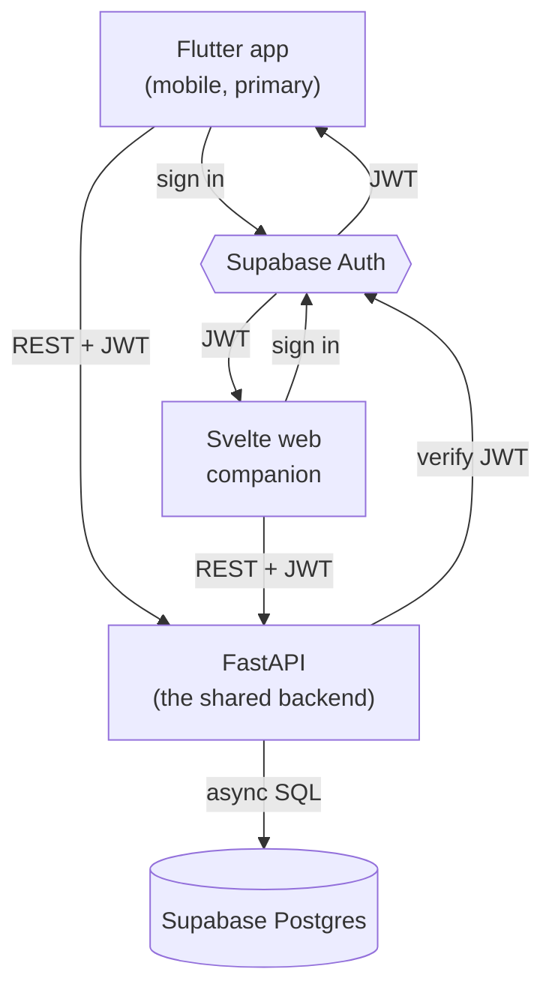

## The shape of the system

FitTrack คือ **backend หนึ่งตัว, สอง client และ managed platform อยู่ข้างล่าง**

client ทั้งสอง **ยืนยันตัวตนด้วย Supabase Auth** แล้วได้ JWT กลับมา จากนั้นทุก request ที่ยิงไป backend จะพก token นั้นไปด้วย และ **FastAPI เป็นสิ่งเดียวที่แตะ data** — มัน verify JWT, รัน business logic แล้วอ่านและเขียน Supabase Postgres ผ่าน connection แบบ async client ไม่เคย query database ตรง ๆ เลย

## Why this split

Supabase ใช้เป็น backend-as-a-service ล้วน ๆ ก็ได้ — client คุยตรงไปยัง Postgres ของมันผ่าน Row-Level Security แต่ FitTrack ตั้งใจไม่ทำแบบนั้น มันวาง **FastAPI ไว้ตรงกลาง** ด้วยสามเหตุผล:

- **มีที่เดียวสำหรับ business logic** "อะไรนับเป็น personal record", "volume รายสัปดาห์คำนวณยังไง", "user แก้ exercise ตัวไหนได้บ้าง" — ของพวกนี้ควรอยู่ในโค้ดที่คุณเป็นเจ้าของและ test เองได้ ไม่ใช่กระจายอยู่ในแอป client สองตัวและกอง SQL policy
- **สอง client, contract เดียว** แอป Flutter กับ Svelte companion ต่างกันมาก แต่ทั้งคู่เรียก REST API *ตัวเดียวกัน* แก้ rule ครั้งเดียว client ทั้งสองได้เหมือนกันหมด นั่นคือหัวใจของโปรเจกต์นี้: สร้าง product สองรอบบน backend เดียว
- **มันสอน Python backend จริง ๆ** FastAPI, async SQLAlchemy, Pydantic, auth ที่ inject ผ่าน dependency — เนื้อหาแท้ ๆ ของ production API — คือสิ่งที่ setup แบบ Supabase client-only จะข้ามไปพอดี

Supabase ยังคุ้มที่จะมีอยู่: **Auth** (สมัคร, เข้าสู่ระบบ, refresh token, OAuth ครบพร้อม client SDK ชั้นดี) และ **managed Postgres** (ไม่ต้องรันหรือ backup database เอง) คืองานจริงที่คุณไม่ต้องสร้างเอง Row-Level Security ยังเปิดไว้เป็น **defense-in-depth** เพื่อว่าถึง token จะหลุด database ตัวมันเองก็ยังบังคับเรื่อง ownership อยู่ดี

## The pieces

- **Supabase Auth** — ออกและ refresh JWT client ใช้ SDK ทางการ (`supabase_flutter`, `supabase-js`); backend แค่ *verify* token เท่านั้น
- **FastAPI** — backend ที่แชร์กัน verify Supabase JWT ทุก request, เป็นเจ้าของ domain logic และเป็นตัวเดียวที่อ่าน/เขียน database
- **Supabase Postgres** — managed database ของ FitTrack: `profiles`, `exercises`, `workouts`, `workout_sets`
- **Flutter app** — client หลักแบบ mobile-first: เข้าสู่ระบบ, เริ่ม workout, บันทึก set, ดู history และ progress
- **Svelte web companion** — dashboard ที่เบากว่าบน API เดียวกัน เน้นการอ่าน

## Verify

คุณพร้อมไปต่อเมื่อตอบคำถามพวกนี้ด้วยคำพูดของตัวเองได้:

- ไล่ action "log a set" ตั้งแต่แตะบนแอป Flutter ไปจนถึง row ใน Postgres JWT ถูกสร้าง, แนบ และ verify ที่ตรงไหนบ้าง?
- ทำไม backend ถึงแค่ *verify* Supabase JWT แทนที่จะออก token ของตัวเอง?
- ถ้า Row-Level Security คือ defense-in-depth และ FastAPI คือ gate ตัวจริง อะไรจะพังถ้าคุณลืมเช็ก `get_current_user` บน endpoint ตัวหนึ่ง — และ RLS ยังปกป้องอะไรอยู่?

ต่อไป [prerequisites](/fittrack/th/introduction/prerequisites/) จะเตรียมเครื่องของคุณให้พร้อม
