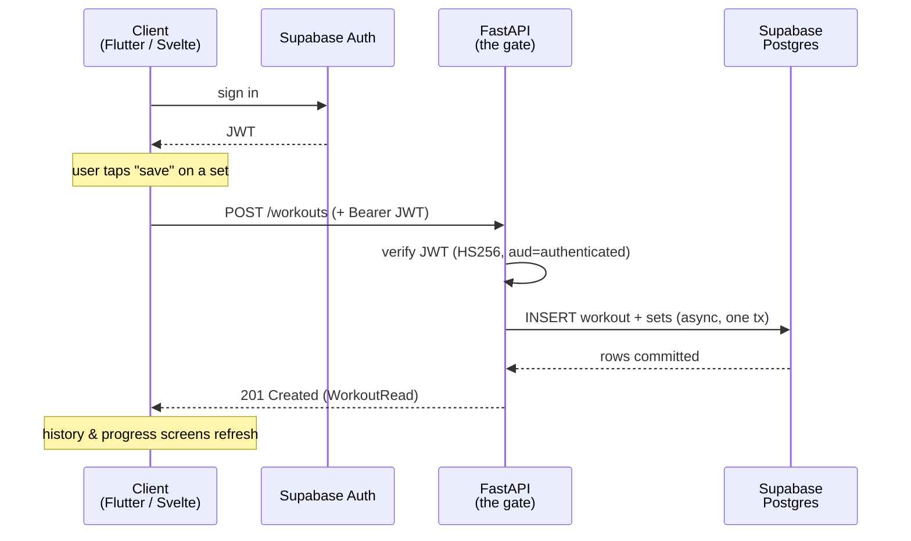

## สิ่งที่คุณสร้างไป

คุณสร้าง **FitTrack**: workout tracker ที่มี **Flutter** app แบบ native, **SvelteKit** web companion, และ **FastAPI** backend ตัวเดียว หนุนหลังด้วย **Supabase** สำหรับ authentication และ managed Postgres — และใน module สุดท้าย คุณ deploy ขึ้นจริงทั้งหมด

ไล่ดูทีละ module แล้วนี่คือ product ที่ครบ ไม่ใช่ของเล่น:

- FastAPI project ที่จัดการด้วย `uv` ([Module 1](/fittrack/th/setup/python-toolchain/)) พร้อม database จริงที่นิยามเป็น migration ([Module 2](/fittrack/th/supabase/schema-and-migrations/))
- Backend ที่ async, config ครบ, มีโครงสร้าง ([Module 3](/fittrack/th/fastapi/app-and-config/)) ที่ verify Supabase JWT และรู้ว่าผู้เรียกคือใคร ([Module 4](/fittrack/th/auth/verify-the-jwt/))
- Domain layer — SQLAlchemy models, Pydantic schemas, repositories ([Module 5](/fittrack/th/domain/sqlalchemy-models/)) — ใต้ REST surface เต็ม: exercise catalog ([Module 6](/fittrack/th/exercises/catalog-crud/)), workout logging ([Module 7](/fittrack/th/workouts/logging-sessions/)), และ progress aggregations ([Module 8](/fittrack/th/progress/aggregation-queries/))
- Client สองตัวบน API เดียวนั้น: Flutter app ที่มี Riverpod, Supabase auth, และ typed API client ([Module 9](/fittrack/th/flutter-foundation/project-and-state/)) ที่ log set และแสดง history ([Module 10](/fittrack/th/flutter-tracking/logging-ui/)), และ SvelteKit dashboard ที่อ่าน endpoint เดียวกัน ([Module 11](/fittrack/th/svelte-companion/dashboard/))
- Tests คลุม backend และ tracking UI ([Module 12](/fittrack/th/testing/pytest-backend/)), แล้ว containerized API บน Supabase แบบ hosted พร้อม client ทั้งสองที่ ship แล้ว ([Module 13](/fittrack/th/deployment/containerize-the-api/))

## เส้นทางของ set ที่ log ไว้หนึ่งตัว

ทุกอย่างข้างบนยุบรวมเป็นการเคลื่อนไหวเดียว: user log set หนึ่งตัว แล้วข้อมูลนั้นเดินทางทั่วทั้งระบบ นี่คือ round trip นั้น — เหมือนกันทั้ง Flutter app และ Svelte companion เพราะทั้งคู่ใช้ backend ร่วมกัน

อ่านจากบนลงล่างแล้วทุก module มีที่ทางในนั้น client ได้ **JWT** จาก Supabase Auth ([Module 4](/fittrack/th/auth/verify-the-jwt/)) FastAPI **verify** token นั้นก่อนทำอะไร ([Module 4](/fittrack/th/auth/current-user/)) การเขียนลงไปเป็น **async transaction เดียว** ผ่าน domain layer ([Module 7](/fittrack/th/workouts/logging-sessions/)) และ response กลับมาเป็น typed **Pydantic** shape ([Module 5](/fittrack/th/domain/schemas-and-repositories/)) ที่ client render client ไม่เคยแตะ database เลย — FastAPI เป็นสิ่งเดียวที่แตะ

## การตัดสินใจที่คุณอธิบายเหตุผลได้แล้ว

ทุกข้อคือทางแยกที่มีทางเลือกจริง ตอนนี้คุณบอกได้ว่า *ทำไม* คุณถึงเลือกทางนั้น — และแลกมาด้วยอะไร

| Decision | Why it wins | The tradeoff | Where you made it |
|---|---|---|---|
| **FastAPI as the shared backend** | ที่เดียวเป็นเจ้าของ business logic และ data access; client ทั้งสองจึงบางและสอดคล้องกัน | เพิ่ม hop หนึ่งที่ client อาจข้ามได้ด้วยการคุยกับ Supabase ตรง ๆ | [Architecture →](/fittrack/th/introduction/architecture/) |
| **Supabase for Auth + managed Postgres** | คุณไม่ต้องสร้าง password reset, token issuance, หรือรัน database เอง — คุณใช้ตัวที่ managed แล้วเขียน feature แทน | ต้องพึ่ง platform; คุณอยู่ใน model และ pricing ของ Supabase | [Auth & RLS →](/fittrack/th/supabase/auth-and-rls/) |
| **RLS as defense-in-depth** | ถ้ามี token ไปถึง database ตรง ๆ เมื่อไร row policy ยังกั้น user ให้อยู่แต่ row ของตัวเอง | policy ที่ต้อง maintain แต่ path ของ API ไม่ได้ใช้ในแต่ละวัน | [Auth & RLS →](/fittrack/th/supabase/auth-and-rls/) |
| **One repo, two clients** | API contract ร่วมกัน, source of truth เดียว, เปลี่ยนข้าม client ได้แบบ atomic | repo ใหญ่ขึ้นและมี build/ship pipeline สองแบบที่ต่างกันมากที่ต้องคอยให้เขียว | [Architecture →](/fittrack/th/introduction/architecture/) |
| **Async SQLAlchemy 2.0** | DB I/O ที่ไม่ block เข้ากับ async model ของ FastAPI และ scale ได้ภายใต้ request พร้อมกันหลายตัว | async engine กับ session dependency มีพิธีรีตองมากกว่า sync ORM | [Async database →](/fittrack/th/fastapi/async-database/) |
| **Local-first development** | ทั้ง stack — Postgres, Auth, migrations — รันบนเครื่องคุณ production จึงเป็นการเปลี่ยน config ไม่ใช่การเขียนใหม่ | คุณรัน Supabase CLI stack ในเครื่องแทนที่จะ develop กับ cloud | [Schema & migrations →](/fittrack/th/supabase/schema-and-migrations/) |

## สิ่งที่จงใจทำให้ง่ายลง

FitTrack ถูก scope ไว้ ไม่ใช่ทำไม่เสร็จ แต่ละข้อคือ "ไม่ใช่ตอนนี้" ที่ตั้งใจ เพื่อให้คอร์สสอนแกนหลักครบ end to end แทนที่จะบานปลาย:

- **ไม่มี training programs หรือ plans** คุณ log สิ่งที่คุณ *ทำไปแล้ว*; แอปไม่ได้กำหนดว่าให้ทำอะไรต่อ นั่นเป็นทั้ง domain ของ scheduling และ templating เก็บไว้ที่ [Next steps →](/fittrack/th/wrap-up/next-steps/)
- **ไม่มี social หรือ sharing** ไม่มี follower, feed, หรือ workout ที่แชร์กัน ทุก row เป็นของ user คนเดียว ซึ่งทำให้ [auth และ RLS model](/fittrack/th/supabase/auth-and-rls/) เรียบง่าย
- **ไม่มี nutrition** อาหารและแคลอรีเป็น product ที่สองทั้งตัว; FitTrack track เฉพาะการเทรน โดยตั้งใจ ([product scope](/fittrack/th/introduction/architecture/))
- **ไม่มี offline sync** Flutter app สมมติว่ามีการเชื่อมต่อและคุยกับ API แบบ live ([Module 10](/fittrack/th/flutter-tracking/logging-ui/)); local cache ที่มี conflict resolution เป็น feature จริงจังในตัวเอง
- **profile แบบ minimal** `profiles` เก็บ `display_name` และแทบไม่มีอะไรอื่น ([the schema](/fittrack/th/supabase/schema-and-migrations/)) — พอที่จะเป็นเจ้าของ workout ไม่มากกว่านั้น

ไม่มีข้อไหนที่ขาดไปโดยบังเอิญ ทั้งหมดคือ feature ต่อไปตามธรรมชาติ และ [next lesson →](/fittrack/th/wrap-up/next-steps/) แสดงชัดว่าแต่ละอันเสียบเข้ากับสิ่งที่คุณสร้างไว้แล้วตรงไหน

## สรุป

คุณสร้าง fitness tracker แบบ two-client ที่จริงและ deploy แล้วบน FastAPI backend เดียวและ managed Supabase และตอนนี้คุณตาม logged set หนึ่งตัวผ่าน **client → Supabase Auth → FastAPI → Postgres → กลับ** ได้โดยไม่ต้องกำกวม มากกว่าโค้ด คุณเดินจากไปพร้อม **การตัดสินใจที่คุณ defend ได้**: ทำไม FastAPI เป็น gate, ทำไม Supabase, ทำไม RLS เป็นตาข่ายรองไม่ใช่ประตูหน้า, ทำไม repo เดียว, ทำไม async, ทำไม local-first — แต่ละอย่างพร้อม tradeoff ที่แบกมาด้วย และคุณรู้แน่ชัดว่าอะไรที่คุณ *ไม่ได้* สร้างและทำไม ต่อไป [Next steps →](/fittrack/th/wrap-up/next-steps/) จะเปลี่ยนการละเว้นที่ตั้งใจเหล่านั้นเป็น roadmap ของคุณ — feature ที่เป็นรูปธรรมให้เพิ่ม, แต่ละอันสอนอะไร, และเสียบเข้ากับระบบที่คุณมีอยู่แล้วตรงไหน
